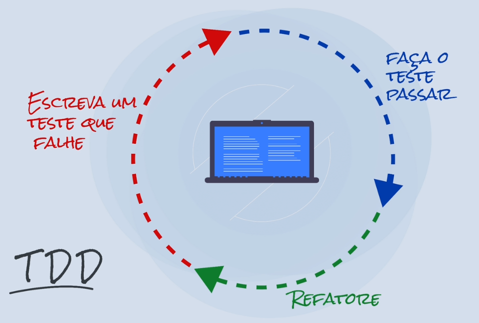

# Testes-com-React

Este repositório contém exemplos de testes utilizando a biblioteca React Testing Library. Os testes são escritos para componentes React e visam garantir que a aplicação funcione corretamente, verificando a renderização, interações e comportamento dos componentes.

# Comando usado para criar um projeto básico com Vite e React para treinar os testes

```bash
npm create vite@latest meu-projeto --template react
```


## Tecnologias Utilizadas
- React
- React Testing Library
- Jest
- Cypress

## Como Rodar os Testes
1. Clone o repositório:
```bash
git clone <URL_DO_REPOSITORIO>
```

## tipos de testes
- Testes unitários: Focam em testar componentes isoladamente, garantindo que cada parte do componente funcione corretamente.
- Testes de integração: Verificam a interação entre diferentes componentes, garantindo que eles funcionem juntos como esperado.
- Testes end-to-end (E2E): Simulam o comportamento do usuário, testando a aplicação como um todo para garantir que todas as partes funcionem corretamente em conjunto.


## Criando os primeiro testes
1. Instale as dependências necessárias:
```bashnpm install @testing-library/react @testing-library/jest-dom jest
```     
2. Crie um arquivo de teste para o componente que deseja testar, por exemplo `MeuComponente.test.js`. o nome do arquivo deve seguir o padrão `*.test.js` para que o Jest possa reconhecê-lo como um arquivo de teste. o arquivo de teste deve ser o nome arquivo do componente que deseja testar, seguido de `.test.js`. por exemplo, se o componente se chama `MeuComponente.js`, o arquivo de teste deve ser nomeado como `MeuComponente.test.js`.
3. Escreva os testes utilizando a React Testing Library e Jest, por exemplo:

```javascript
import {render, screen} from "@testing-library/react";
import App from "./App";
describe("testa o componente App", ()=>{

    //deve haver uma título
    test("there must be two titles", async ()=>{
        render(<App/>);

        const titles = await screen.findAllByRole("heading");//procura um titulo

        expect(titles).toHaveLength(2);// espero que ele esteja no documento 
    });

    //deve haver uma título escrito 'hello world'
    test("there must be a title", async ()=>{
        render(<App/>);

        const title = await screen.findByRole("heading",{name:"hello world",});//procura um titulo

        expect(title).toBeInTheDocument();// espero que ele esteja no documento
    });


})
```
4. Execute os testes utilizando o comando:
```bash
npm test
```
## Importante
 O describe ou test são blocos de teste, ou um conjunto de testes é como se criassemos uma caixa com testes menores, onde o describe é usado para agrupar testes relacionados e o test é usado para definir um teste específico. O describe pode conter vários testes, enquanto o test é usado para definir um teste individual. O describe ajuda a organizar os testes e torna mais fácil entender o que está sendo testado, enquanto o test é onde você escreve a lógica do teste em si.

<br><br><br><br>

 # Mocks

 ## O que são Mocks?
 Mocks são objetos ou funções simuladas que imitam o comportamento de objetos ou funções reais em um ambiente de teste. Eles são usados para isolar o código que está sendo testado, permitindo que você controle o comportamento de dependências externas, como APIs, bancos de dados ou outros serviços.

 ## Por que usar Mocks?
 - Isolamento: Mocks permitem que você teste um componente ou função sem depender de suas dependências externas, garantindo que os testes sejam mais confiáveis e rápidos.
 - Controle: Facilita a simulação de comportamentos especificos para testar cenários diversos. Com Mocks, você pode controlar o comportamento das dependências, simulando diferentes cenários e respostas para testar como o código lida com essas situações.
 - Simplicidade: Mocks simplificam a configuração do ambiente de teste, evitando a necessidade de configurar e gerenciar dependências complexas.    
 - Velocidade: Mocks geralmente são mais rápidos do que as dependências reais, o que pode acelerar significativamente a execução dos testes.
 - Eficiência: evita execução de código desnecessário, como chamadas a API's externas, melhorando a velocidade dos testes.

## Como criar Mocks?
1. Usando Jest:
```javascript
jest.mock('nome-do-modulo', () => {
  return {
    funcaoMockada: jest.fn(() => 'valor simulado'),
  };
});
```
2. Usando bibliotecas de Mock:
- Sinon: Uma biblioteca de Mock para JavaScript que oferece funcionalidades avançadas para criar Mocks, stubs e spies.
- Mock Service Worker (MSW): Uma biblioteca que permite criar Mocks para APIs REST e GraphQL, interceptando as requisições de rede e retornando respostas simuladas.
- Nock: Uma biblioteca de Mock para Node.js que permite interceptar e simular requisições HTTP, facilitando o teste de código que depende de APIs externas. 

3. Criando Mocks manualmente:
```javascript
const mockFuncao = jest.fn(() => 'valor simulado'); 
```
```javascript
const mockObjeto = {
  funcaoMockada: jest.fn(() => 'valor simulado'),
};
``` 
## Considerações Finais
- Mocks são uma ferramenta poderosa para isolar o código que está sendo testado e controlar o comportamento de dependências externas, mas é importante usá-los com cuidado para garantir que os testes sejam realistas e representem cenários reais de uso. É importante equilibrar o uso de Mocks com testes que utilizam dependências reais para garantir que o código seja testado de maneira abrangente e confiável.


# TDD - Test Driven Development(desenvolvimento orientado a testes)
## O que é TDD?
TDD, é uma metodologia em que os testes vao orientaram como vamos desenvolver o software. que enfatiza a escrita de testes antes de escrever o código de produção. O processo de TDD segue um ciclo de desenvolvimento conhecido como "Red-Green-Refactor", onde os desenvolvedores escrevem um teste que falha (Red), escrevem o código mínimo necessário para fazer o teste passar (Green), e depois refatoram o código para melhorar sua qualidade e legibilidade (Refactor). É uma abordagem que visa melhorar a qualidade do código, aumentar a cobertura de testes e promover um desenvolvimento mais eficiente e orientado a requisitos. Os testes são escritos antes mesmo da implementação do código.

## Processo do TDD
1. Escreva um teste que falha (Red): Comece escrevendo um teste para uma funcionalidade específica que ainda não foi implementada. O teste deve ser escrito de forma a falhar, pois o código de produção ainda não existe.
2. Escreva o código mínimo para fazer o teste passar (Green): Em seguida, escreva o código mínimo necessário para fazer o teste passar. O objetivo aqui é apenas fazer o teste passar, sem se preocupar com a qualidade do código ou a implementação completa da funcionalidade.
3. Refatore o código (Refactor): Depois que o teste passar, refatore o código para melhorar sua qualidade, legibilidade e manutenção. Durante a refatoração, certifique-se de que os testes continuem passando, garantindo que as mudanças não introduzam bugs ou quebrem a funcionalidade existente.
4. Repita o ciclo: Repita esse ciclo para cada nova funcionalidade ou melhoria que deseja implementar, garantindo que cada etapa seja orientada por testes e que o código seja desenvolvido de forma incremental e testável.



## Benefícios do TDD
- Melhoria da qualidade do código: O TDD incentiva a escrita de código mais limpo, modular e testável, o que pode levar a uma melhor qualidade geral do código.
- Aumento da cobertura de testes: Ao escrever testes antes do código, o TDD ajuda a garantir que a maioria do código seja coberta por testes, o que pode aumentar a confiabilidade e a robustez do software.
- Detecção precoce de bugs: O TDD permite que os desenvolvedores detectem e corrijam bugs mais cedo no processo de desenvolvimento, o que pode reduzir o custo e o tempo de correção de bugs.
- Melhoria da colaboração: O TDD pode melhorar a colaboração entre desenvolvedores, testadores e outros membros da equipe, pois os testes servem como documentação viva do comportamento esperado do software, facilitando a comunicação e o entendimento entre os membros da equipe.
- Desenvolvimento orientado a requisitos: O TDD ajuda a garantir que o desenvolvimento seja orientado a requisitos, pois os testes são escritos com base nos requisitos do software, garantindo que o código seja desenvolvido para atender às necessidades do usuário e aos requisitos do projeto. 