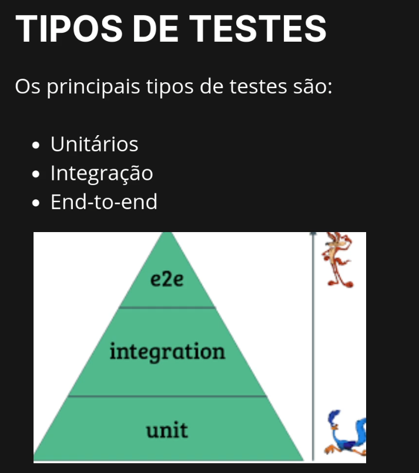

# Testes-com-React

Este repositório contém exemplos de testes utilizando a biblioteca React Testing Library. Os testes são escritos para componentes React e visam garantir que a aplicação funcione corretamente, verificando a renderização, interações e comportamento dos componentes.

# Comando usado para criar um projeto básico com Vite e React para treinar os testes

```bash
npm create vite@latest meu-projeto --template react
```


## Tecnologias Utilizadas
- React
- React Testing Library
- Jest
- Cypress

## Como Rodar os Testes
1. Clone o repositório:
```bash
git clone <URL_DO_REPOSITORIO>
```

## tipos de testes
- Testes unitários: Focam em testar componentes isoladamente, garantindo que cada parte do componente funcione corretamente.
- Testes de integração: Verificam a interação entre diferentes componentes, garantindo que eles funcionem juntos como esperado.
- Testes end-to-end (E2E): Simulam o comportamento do usuário, testando a aplicação como um todo para garantir que todas as partes funcionem corretamente em conjunto.

